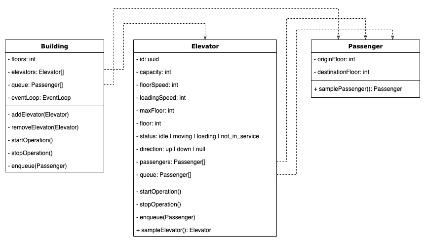
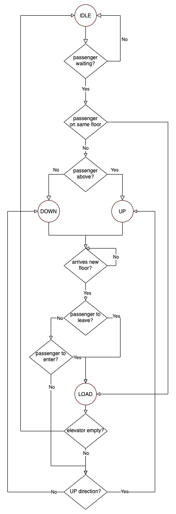

# Elevator Code Challenge - Typescript Solution

[](https://github.com/chrischenyc/elevator-code-challenge/actions)
[](https://codecov.io/gh/chrischenyc/elevator-code-challenge)

## Problem

> You are in charge of writing software for an elevator (lift) company.
> Your task is to write a program to control the travel of a lift for a 10 storey building.
> A passenger can summon the lift to go up or down from any floor. Once in the lift, they can choose the floor they'd like to travel to.
> Your program needs to plan the optimal set of instructions for the lift to travel, stop, and open its doors.
>
> Some test cases:
>
> - Passenger summons lift on the ground floor. Once in, chooses to go to level 5.
> - Passenger summons lift on level 6 to go down. A passenger on level 4 summons the lift to go down. They both choose L1.
> - Passenger 1 summons lift to go up from L2. Passenger 2 summons lift to go down from L4. Passenger 1 chooses to go to L6. Passenger 2 chooses to go to Ground Floor
> - Passenger 1 summons lift to go up from Ground. They choose L5. Passenger 2 summons lift to go down from L4. Passenger 3 summons lift to go down from L10. Passengers 2 and 3 choose to travel to Ground.

## Floor number convention

the solution assumes European/Australasian floor number convention, i.e.: floor 0 is G floor

## Project Structure

```bash
.
└── packages
    ├── engine  // core logic module and unit tests
    └── web     // TODO: demo React web client
```

## Data Models



## Elevator Workflow



discussion: the passengers waiting for an elevator are served on a first-in-first-serve basis. the current solution doesn't cover the situation when multiple passengers are enqueued the waiting list at the exact same time.

## Design Patterns & Principles

- [OOP](https://en.wikipedia.org/wiki/Object-oriented_programming) & [SOLID](https://en.wikipedia.org/wiki/SOLID)
- [TDD](https://en.wikipedia.org/wiki/Test-driven_development)
- [event loop](https://en.wikipedia.org/wiki/Event_loop)

## Run the core tests

make sure [yarn](https://yarnpkg.com) is installed

```bash
yarn
yarn test # all unit test
yarn test:scenarios # test the main testing scenarios with console output
```

test output

```bash
info: ------------------------------
info: No passenger summons lift
info: Elevator 4tIM9hbDe: Started
info: Elevator 4tIM9hbDe: Idle, floor 0
info: Elevator 4tIM9hbDe: Idle, floor 0
info: Elevator 4tIM9hbDe: Stopped
info: ------------------------------
info: Passenger summons lift on the ground floor. Once in, chooses to go to level 5
info: Elevator y1RSfP1gv: Started
info: Elevator y1RSfP1gv: Idle, floor 0
info: Elevator y1RSfP1gv: Idle, floor 0
info: Elevator y1RSfP1gv: Loading, floor 0
info: Elevator y1RSfP1gv: Moving Up, floor 0
info: Elevator y1RSfP1gv: Moving Up, floor 1
info: Elevator y1RSfP1gv: Moving Up, floor 2
info: Elevator y1RSfP1gv: Moving Up, floor 3
info: Elevator y1RSfP1gv: Moving Up, floor 4
info: Elevator y1RSfP1gv: Loading, floor 5
info: Elevator y1RSfP1gv: Idle, floor 5
info: Elevator y1RSfP1gv: Stopped
info: ------------------------------
info: Passenger summons lift on level 6 to go down. A passenger on level 4 summons the lift to go down. They both choose L1.
info: Elevator mlXjAhCsW: Started
info: Elevator mlXjAhCsW: Idle, floor 0
info: Elevator mlXjAhCsW: Idle, floor 0
info: Elevator mlXjAhCsW: Moving Up, floor 0
info: Elevator mlXjAhCsW: Moving Up, floor 1
info: Elevator mlXjAhCsW: Moving Up, floor 2
info: Elevator mlXjAhCsW: Moving Up, floor 3
info: Elevator mlXjAhCsW: Moving Up, floor 4
info: Elevator mlXjAhCsW: Moving Up, floor 5
info: Elevator mlXjAhCsW: Loading, floor 6
info: Elevator mlXjAhCsW: Moving Down, floor 6
info: Elevator mlXjAhCsW: Moving Down, floor 5
info: Elevator mlXjAhCsW: Loading, floor 4
info: Elevator mlXjAhCsW: Moving Down, floor 4
info: Elevator mlXjAhCsW: Moving Down, floor 3
info: Elevator mlXjAhCsW: Moving Down, floor 2
info: Elevator mlXjAhCsW: Loading, floor 1
info: Elevator mlXjAhCsW: Idle, floor 1
info: Elevator mlXjAhCsW: Stopped
info: ------------------------------
info: Passenger 1 summons lift to go up from L2. Passenger 2 summons lift to go down from L4. Passenger 1 chooses to go to L6. Passenger 2 chooses to go to Ground Floor
info: Elevator 9RF2YnlnO: Started
info: Elevator 9RF2YnlnO: Idle, floor 0
info: Elevator 9RF2YnlnO: Idle, floor 0
info: Elevator 9RF2YnlnO: Moving Up, floor 0
info: Elevator 9RF2YnlnO: Moving Up, floor 1
info: Elevator 9RF2YnlnO: Loading, floor 2
info: Elevator 9RF2YnlnO: Moving Up, floor 2
info: Elevator 9RF2YnlnO: Moving Up, floor 3
info: Elevator 9RF2YnlnO: Moving Up, floor 4
info: Elevator 9RF2YnlnO: Moving Up, floor 5
info: Elevator 9RF2YnlnO: Loading, floor 6
info: Elevator 9RF2YnlnO: Idle, floor 6
info: Elevator 9RF2YnlnO: Moving Down, floor 6
info: Elevator 9RF2YnlnO: Moving Down, floor 5
info: Elevator 9RF2YnlnO: Loading, floor 4
info: Elevator 9RF2YnlnO: Moving Down, floor 4
info: Elevator 9RF2YnlnO: Moving Down, floor 3
info: Elevator 9RF2YnlnO: Moving Down, floor 2
info: Elevator 9RF2YnlnO: Moving Down, floor 1
info: Elevator 9RF2YnlnO: Loading, floor 0
info: Elevator 9RF2YnlnO: Idle, floor 0
info: Elevator 9RF2YnlnO: Stopped
info: ------------------------------
info: Elevator ty6hgZSRP: Started
info: Elevator ty6hgZSRP: Idle, floor 0
info: Passenger 1 summons lift to go up from Ground. Then choose L5. Passenger 2 summons lift to go down from L4. Passenger 3 summons lift to go down from L10. Passengers 2 and 3 choose to travel to Ground.
info: Elevator ty6hgZSRP: Idle, floor 0
info: Elevator ty6hgZSRP: Loading, floor 0
info: Elevator ty6hgZSRP: Moving Up, floor 0
info: Elevator ty6hgZSRP: Moving Up, floor 1
info: Elevator ty6hgZSRP: Moving Up, floor 2
info: Elevator ty6hgZSRP: Moving Up, floor 3
info: Elevator ty6hgZSRP: Moving Up, floor 4
info: Elevator ty6hgZSRP: Loading, floor 5
info: Elevator ty6hgZSRP: Idle, floor 5
info: Elevator ty6hgZSRP: Moving Down, floor 5
info: Elevator ty6hgZSRP: Loading, floor 4
info: Elevator ty6hgZSRP: Moving Down, floor 4
info: Elevator ty6hgZSRP: Moving Down, floor 3
info: Elevator ty6hgZSRP: Moving Down, floor 2
info: Elevator ty6hgZSRP: Moving Down, floor 1
info: Elevator ty6hgZSRP: Loading, floor 0
info: Elevator ty6hgZSRP: Idle, floor 0
info: Elevator ty6hgZSRP: Moving Up, floor 0
info: Elevator ty6hgZSRP: Moving Up, floor 1
info: Elevator ty6hgZSRP: Moving Up, floor 2
info: Elevator ty6hgZSRP: Moving Up, floor 3
info: Elevator ty6hgZSRP: Moving Up, floor 4
info: Elevator ty6hgZSRP: Moving Up, floor 5
info: Elevator ty6hgZSRP: Moving Up, floor 6
info: Elevator ty6hgZSRP: Moving Up, floor 7
info: Elevator ty6hgZSRP: Moving Up, floor 8
info: Elevator ty6hgZSRP: Moving Up, floor 9
info: Elevator ty6hgZSRP: Loading, floor 10
info: Elevator ty6hgZSRP: Moving Down, floor 10
info: Elevator ty6hgZSRP: Moving Down, floor 9
info: Elevator ty6hgZSRP: Moving Down, floor 8
info: Elevator ty6hgZSRP: Moving Down, floor 7
info: Elevator ty6hgZSRP: Moving Down, floor 6
info: Elevator ty6hgZSRP: Moving Down, floor 5
info: Elevator ty6hgZSRP: Moving Down, floor 4
info: Elevator ty6hgZSRP: Moving Down, floor 3
info: Elevator ty6hgZSRP: Moving Down, floor 2
info: Elevator ty6hgZSRP: Moving Down, floor 1
info: Elevator ty6hgZSRP: Loading, floor 0
```

## More unit tests

```bash
cd packages/engine
yarn
yarn test
```
